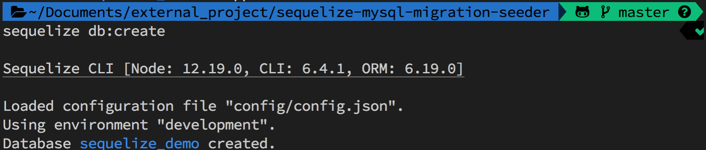
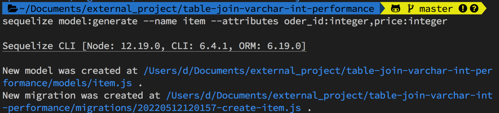
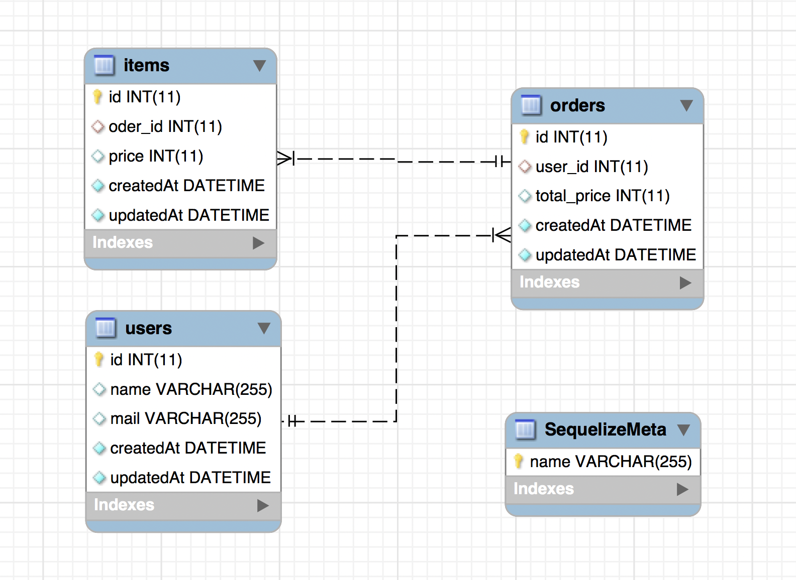
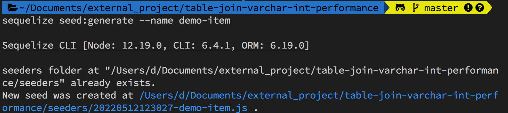
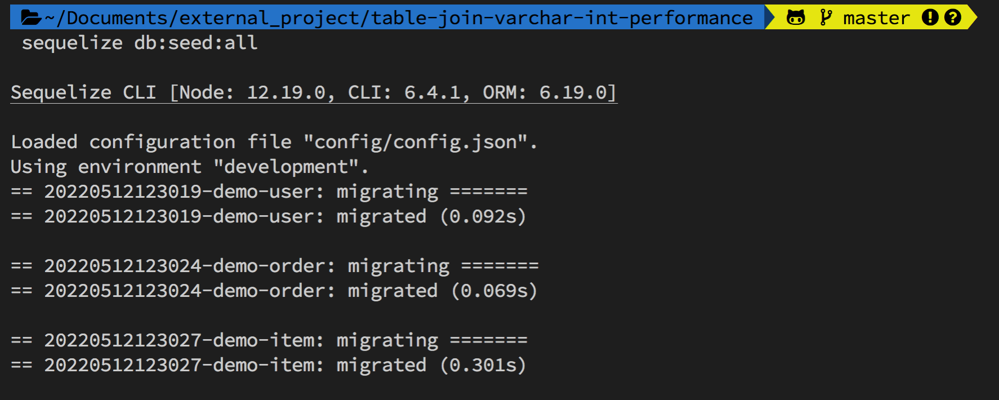
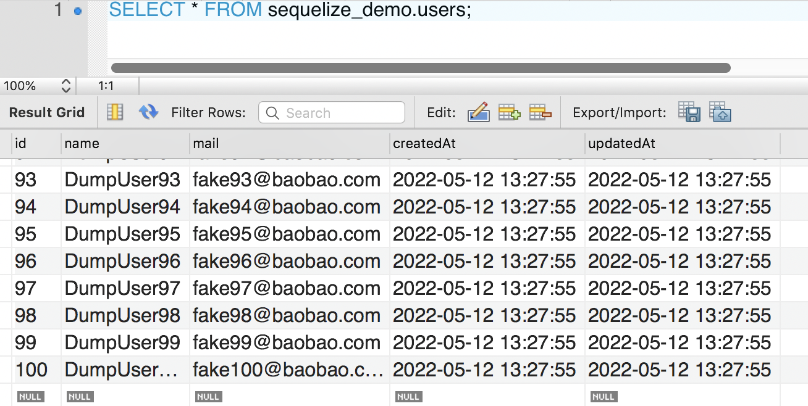
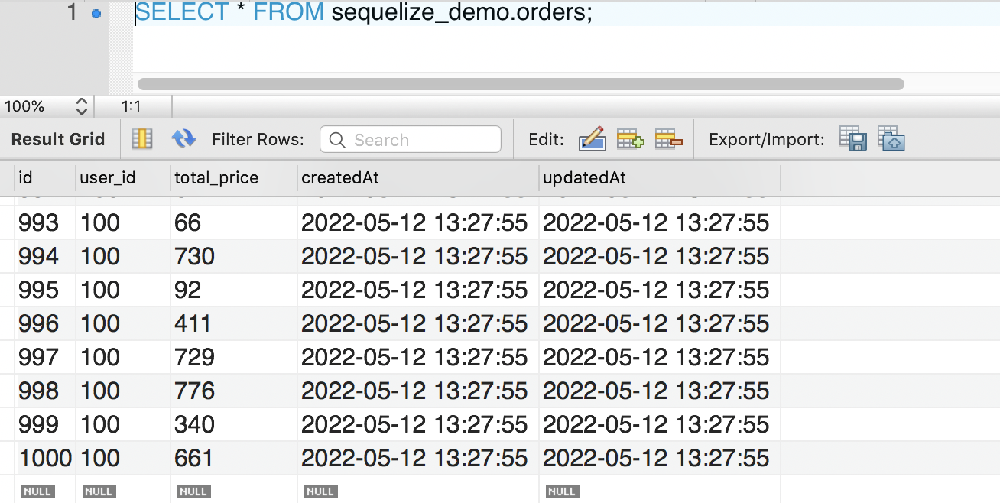
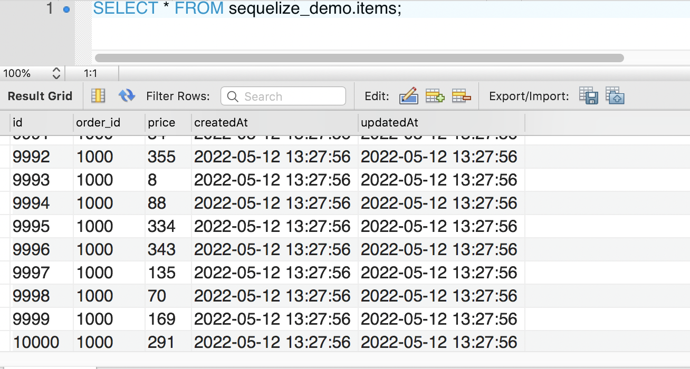
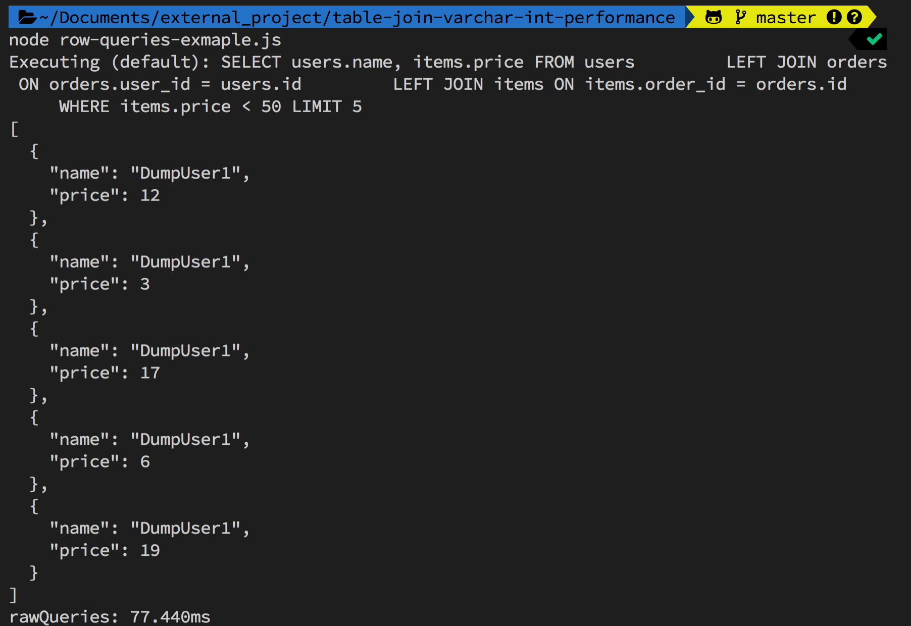

# 初探 sequelize，在 Node.js 快速建立 Migration、Seeder（資料庫為 MySQL）

最近在尋找 Node.js 裡面方便操作 Migration、Seeder 的套件，逛著逛著發現 sequelize 在 GitHub 上擁有超高人氣；抱著踩雷的心態過來嘗試，於是這篇初探 sequelize 的筆記都誕生了，希望可以幫助到第一次使用 sequelize 的朋友們。

- 我能學到什麼 🤔：sequelize 基礎使用方式。
- 我能學會嗎 🤔：筆者從零開始建立專案，並附上詳細的指令與說明，相信大家都能學得開心。
- 文章目標 🤩：建立一個有使用者（user）、訂單（order）、購買貨物（item）的資料庫，設計 Table 彼此的關連性，透過 Query 確認資料。

### 大綱

- 一、初始化專案
- 二、透過 Config 建立 DB
- 三、用 Migration 建立 Table
- 四、用 Seeder 建立假資料(Dummy Data)
- 五、簡易 Query

# ㄧ、初始化專案

**STEP 1**：建立專案資料夾

```
mkdir sequelize-demo && cd  sequelize-demo
npm init
```

**STEP 2**：安裝 sequelize

```
npm install -g sequelize-cli
npm install --save sequelize
```

**STEP 3**：安裝你想使用的 DB（本篇文章以 MySQL 為範例）

```
npm install --save mysql2 #本篇文章
npm install --save pg pg-hstore # Postgres
npm install --save mariadb
npm install --save sqlite3
npm install --save tedious # Microsoft SQL Server
```

---

# 二、透過 Config 建立 DB

**STEP 1**：用指令初始化相關設定檔

```
sequelize init
```

**STEP 2**：調整 sequelize 的 `config/config.json` 檔

預設使用的環境都是`development`，記得調整成自己的 DB 登入參數

```json
"development": {
    "username": "root",
    "password": "baobaoverycute",
    "database": "sequelize_demo",
    "host": "127.0.0.1",
    "dialect": "mysql"
  },
```

**STEP 3**：依照剛剛設定的 `config/config.json` 來建立 DB

```
sequelize db:create
```



> 如果想要移除該 DB，可透過指令：`sequelize db:drop`

---

# 三、用 Migration 建立 Table

**STEP 1**：新增所需 Tables & 基礎欄位

根據文章目標，我們需要建立 3 個 Tables：使用者（user）、訂單（order）、購買貨物（item）

```
sequelize model:generate --name user --attributes name:string,mail:string
sequelize model:generate --name order --attributes user_id:integer,total_price:integer
sequelize model:generate --name item --attributes order_id:integer,price:integer
```

> 如果沒有填寫「attributes」的參數會無法建立 Table。
> 

**STEP 2**：前往 migrations 的資料夾，設計 Table 間的關聯性

調整 order Table，建立 user_id 與 user 的關聯性（一個 user 會對應到多筆 order）

```js
user_id: {
    type: Sequelize.INTEGER,
    references: {
        model: 'users',
        key: 'id'
    },
},
```

調整 item Table，建立 order_id 與 item 的關聯性（一個 order 會對應到多筆 item）

```js
oder_id: {
    type: Sequelize.INTEGER,
    references: {
        model: 'orders',
        key: 'id'
    },
},
```

**STEP 3**：修改完成之後，就可以下指令建立剛剛設定的 Table 啦～

```
sequelize db:migrate
```


下圖是用 MySQLWorkbench 產生的 ER Diagram



> 如果想要回溯 migration 可用如下指令：
>
> - 退一個版本：`sequelize db:migrate:undo`
> - 退到初始狀態：`sequelize db:migrate:undo:all`
> - 退到指定版本：`sequelize db:migrate:undo:all --to XXXXXXXXXXXXXX-create-user.js `

---

# 四、用 Seeder 建立假資料(Dummy Data)

**目標**：建立 100 個使用者（user），每個使用者有 10 筆訂單（order），每筆訂單下面有 10 個貨物（item）。

**STEP 1**：先建立 Seeder 檔案

```
sequelize seed:generate --name demo-user
sequelize seed:generate --name demo-order
sequelize seed:generate --name demo-item
```



**STEP 2**：建立各自 Seeder 資料產生的邏輯，下面以 order 舉例：

```js
"use strict";

module.exports = {
  async up(queryInterface, Sequelize) {
    function getRandomInt(max) {
      return Math.floor(Math.random() * max);
    }
    // 100 個使用者，每個使用者有 10 筆訂單（order）
    var orderArray = [];

    for (let i = 1; i <= 100; i++) {
      for (let j = 1; j <= 10; j++) {
        const order = {
          user_id: i,
          total_price: Math.floor(Math.random() * 1000),
          createdAt: new Date(),
          updatedAt: new Date(),
        };
        orderArray.push(order);
      }
    }

    return queryInterface.bulkInsert("Orders", orderArray);
  },

  async down(queryInterface, Sequelize) {
    return queryInterface.bulkDelete("Orders", null, {});
  },
};
```

**STEP 3**：執行 Seeder

執行單個 Seeder

```
sequelize db:seed --seed my_seeder_file.js
```

執行全部 Seeder

```
sequelize db:seed:all
```



**STEP 4**：前往 DB ，確認資料是否有正確寫入：

1. 建立 100 個使用者（users）。
   
2. 建立 100 個使用者（users），每個使用者有 10 筆訂單（orders），共 1000 筆資料。
   
3. 建立 100 個使用者（users），每個使用者有 10 筆訂單（orders），每筆訂單下面有 10 個貨物（items），共 10000 筆資料。
   

> 取消執行的 Seeder 可用如下指令：
>
> - 取消最近的 Seeder：`sequelize db:seed:undo`
> - 取消指定的 Seeder：`sequelize db:seed:undo --seed my_seeder_file.js`
> - 取消全部 Seeder：`sequelize db:seed:undo:all`

---

### 五、簡易 Query

**STEP 1**：在專案資料夾下建立一個 `row-queries-exmaple.js` 的檔案。

**STEP 2**：將如下程式複製貼上，這是一個簡單 Raw Queries；會找出 price 低於 50 的 5 筆購買貨物，以及對應的使用者。

```js
const { sequelize } = require("./models");
const { QueryTypes } = sequelize;

async function rawQueries() {
  console.time("rawQueries");
  const results = await sequelize.query("SELECT users.name, items.price FROM users\
         LEFT JOIN orders ON orders.user_id = users.id\
         LEFT JOIN items ON items.order_id = orders.id\
         WHERE items.price < 50 LIMIT 5", { type: QueryTypes.SELECT });
  console.log(JSON.stringify(results, null, 2));
  console.timeEnd("rawQueries");
}
rawQueries();
```

**STEP 3**：在終端機輸入：`node row-queries-exmaple.js`

下圖即可看到看到搜尋結果、程式執行時間。



### 參考資料

1. [透過 sequelize 來達成 DB Schema Migration](https://hackmd.io/@TSMI_E7ORNeP8YBbWm-lFA/ryCtaVW_M?print-pdf)
